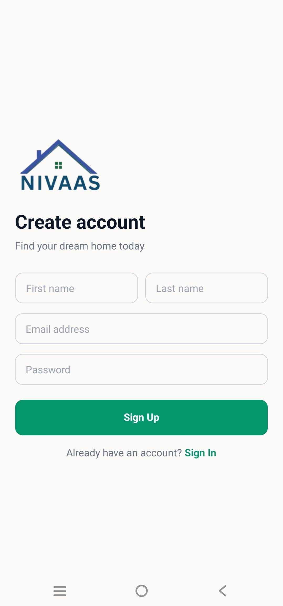
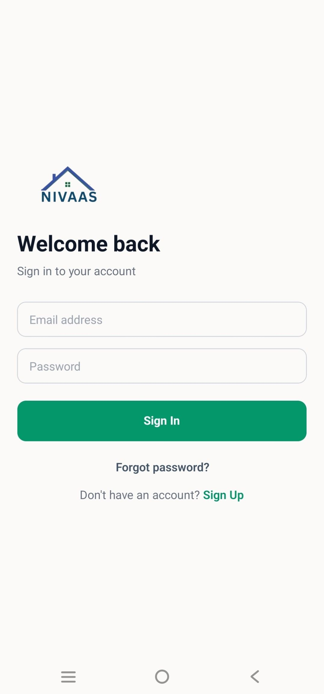
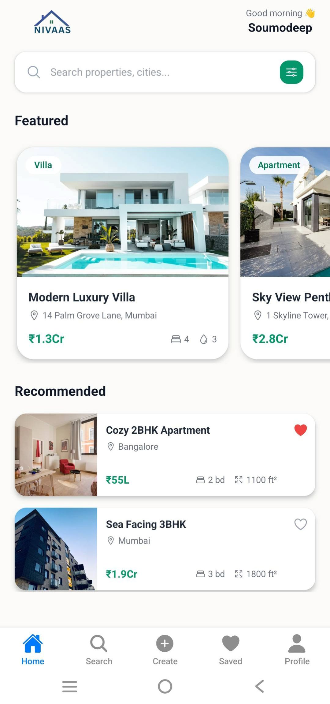
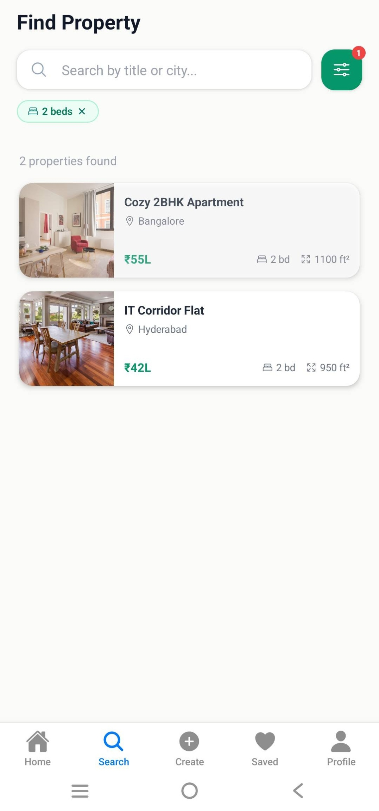
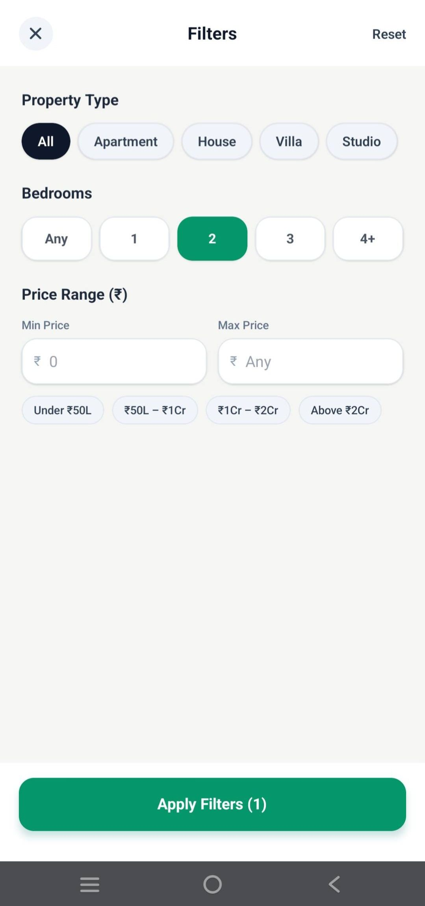
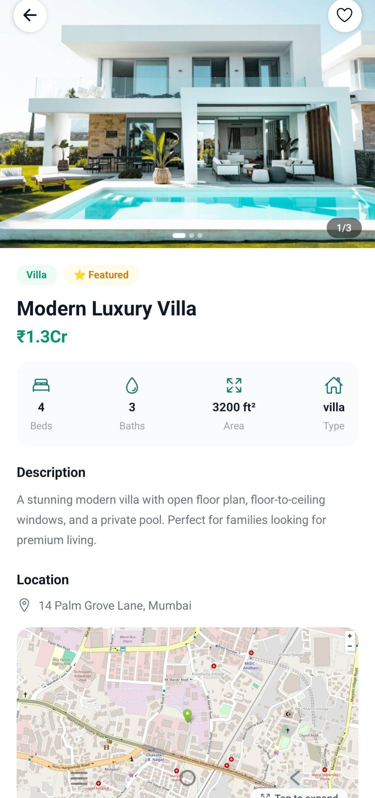
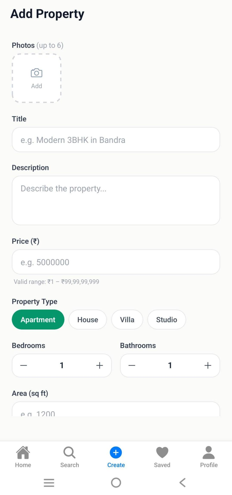
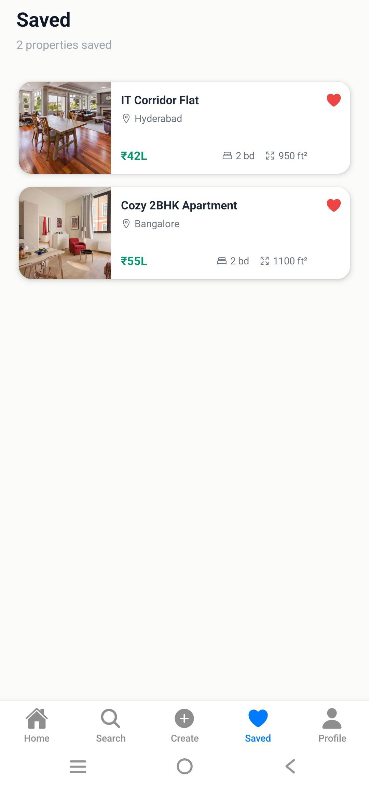
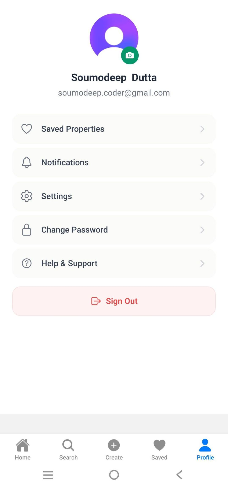

# Nivaas


Nivaas is a modern real-estate mobile application built with Expo Router and React Native. Users can explore featured properties, search and filter listings, save favorites, view property locations on maps, and manage their profile with secure Clerk authentication and Supabase-backed storage.

## Built With

- Expo Router
- React Native
- TypeScript
- Clerk Authentication
- Supabase Backend
- NativeWind Styling

## Preview

- Browse featured properties
- Search and filter listings
- Save favorite properties
- View property locations on maps
- Secure authentication with Clerk

## Architecture

- File-based routing with Expo Router
- Global state management using Zustand
- Backend and storage powered by Supabase
- Clerk authentication integrated with Supabase JWT

## Tech Stack

- Expo SDK 54
- React Native 0.81
- TypeScript
- Expo Router for file-based navigation
- Clerk for authentication and user sessions
- Supabase for data, storage, and row-level security
- NativeWind and Tailwind CSS for styling
- Zustand for local filter and user state
- Expo Image Picker, Expo Location, and WebView for media and map features

## Features

- Authentication flow with sign-in and sign-up screens
- Home feed with featured and recommended properties
- Search with filters for type, bedrooms, and price range
- Save and manage favorite properties
- Property detail page with image gallery, map preview, and contact support
- Full-screen property map view using OpenStreetMap and Google Maps deep link
- Property listing creation flow with image upload and location capture
- Profile screen with avatar update, password change, and sign-out

## Demo Screenshots

| Sign Up                              | Sign In                              | Forgot Password                                      | Home Screen                     | Search Screen                       |
| ------------------------------------ | ------------------------------------ | ---------------------------------------------------- | ------------------------------- | ----------------------------------- |
|  |  |  |  |  |

| Filter Search                             | Property Details                                         | Create Property                     | Saved Properties                   | Profile                                |
| ----------------------------------------- | -------------------------------------------------------- | ----------------------------------- | ---------------------------------- | -------------------------------------- |
|  |  |  |  |  |

## Project Structure

```text
app/
  _layout.tsx
  +not-found.tsx
  index.tsx
  (auth)/
    _layout.tsx
    sign-in.tsx
    sign-up.tsx
  (root)/
    _layout.tsx
    (tabs)/
      _layout.tsx
      index.tsx
      search.tsx
      saved.tsx
      create.tsx
      profile.tsx
    property/
      [id].tsx
      map.tsx
components/
  FeaturedCard.tsx
  FilterModal.tsx
  PropertyCard.tsx
hooks/
  useSavedProperty.ts
  useSupabase.ts
  useUser.ts
lib/
  supabase.ts
  utils.ts
store/
  filterStore.ts
  userStore.ts
types/
  index.ts
assets/
  images/
```

## Prerequisites

- Node.js 23 or newer
- npm
- An Expo-compatible development environment for Android, iOS, or web
- Supabase project and Clerk application credentials

## Environment Variables

Create a local environment file and provide the Supabase values used by the app:

```env
EXPO_PUBLIC_SUPABASE_URL=
EXPO_PUBLIC_SUPABASE_KEY=
EXPO_PUBLIC_CLERK_PUBLISHABLE_KEY=
```

If you are configuring Clerk in your own environment, add the required Clerk Expo variables as well.

## Setup

1. Clone the repository.

```bash
  git clone https://github.com/Soumodeep084/nivaas-rn.git
  cd nivaas-rn
```

2. Install dependencies.

```bash
    npm install
```

3. Configure your environment variables.

4. Start the development server.

```bash
   npm run start
```

5. Open the app on the platform you want.

```bash
   npm run android
   npm run ios
   npm run web
```

## Database Notes

- The Supabase table definitions, RLS policies, storage bucket setup, and sample seed data are documented in [db.md](db.md).

## Scripts

- `npm run start` - Start the Expo development server
- `npm run android` - Open the app on Android
- `npm run ios` - Open the app on iOS
- `npm run web` - Run the app in the browser
- `npm run lint` - Lint the project

## Future Improvements

- Push notifications
- Property chat system
- Advanced filtering
- Property analytics dashboard

## Contributing

Contributions are welcome.

1. Fork the repository.
2. Create a feature branch.
3. Make your changes and keep them focused.
4. Run linting before opening a pull request.
5. Submit a PR with a clear summary of the change.

## License

This project is licensed under the MIT License. See [LICENSE](LICENSE) for the full text.

## Notes

- The app uses file-based routing through Expo Router.
- Authenticated actions use Clerk and a Supabase client that attaches the Clerk JWT.
- This project was built using Expo Router with TypeScript and follows a modular folder structure for scalability.
